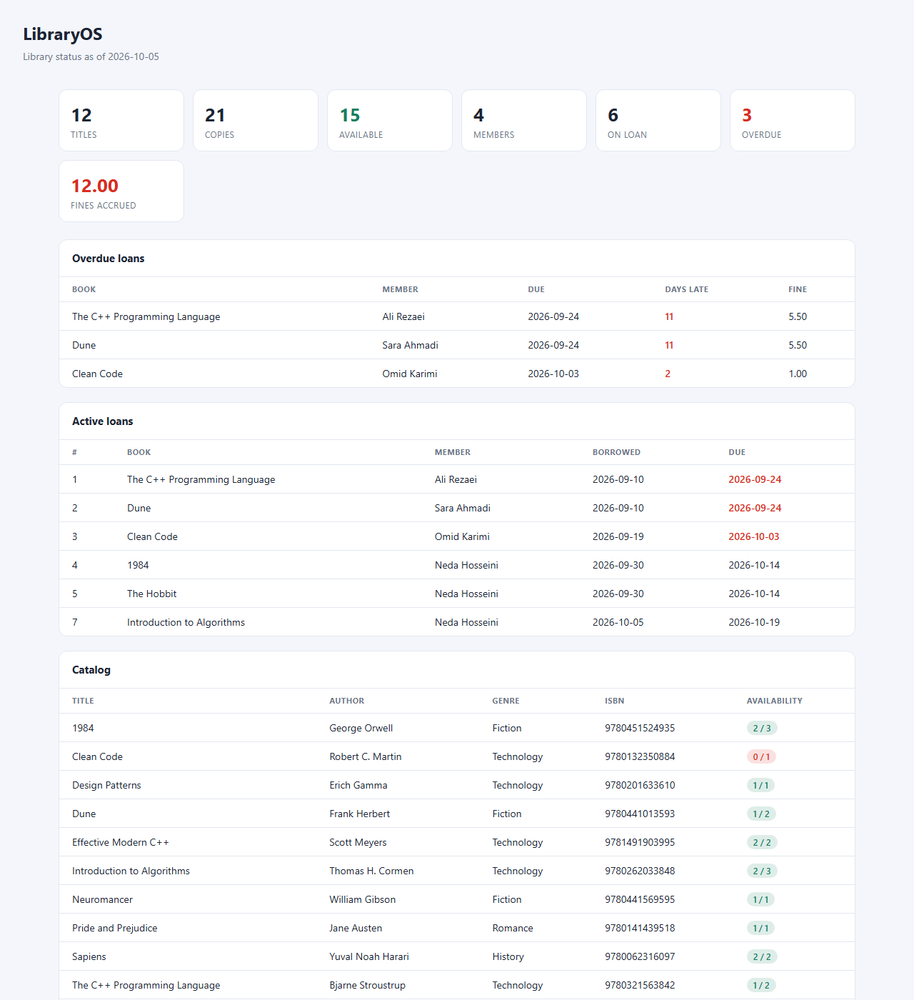
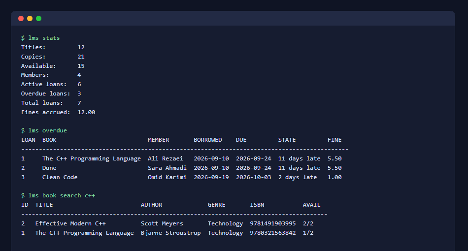

# LibraryOS

A library management system written in modern C++17 with SQLite persistence. It handles the full
circulation workflow of a small public or school library: catalog, members, loans, due dates,
overdue tracking and fines. It comes with a command-line tool and a one-command HTML dashboard.



## Features

- **Catalog** - add, search (title, author, genre, ISBN) and remove books with multiple copies per title
- **ISBN validation** - ISBN-10 and ISBN-13 checksums, hyphens/spaces ignored, duplicates rejected
- **Members** - registration with unique e-mail addresses
- **Circulation rules** - 14-day loans, at most 5 active loans per member, no new loans while a member has an overdue book
- **Fines** - 0.50 per overdue day, accrued live for open loans and frozen when the book is returned
- **Reports** - overdue list, per-member history, library statistics
- **HTML dashboard** - `lms export-html` renders a self-contained, dark-mode aware page
- **Persistent storage** - a single SQLite file, with foreign keys and constraints enforced by the database
- **Tested** - a dependency-free test suite covers dates, ISBNs, catalog, circulation and limits



## Build

Requires a C++17 compiler. SQLite is vendored in `third_party/sqlite3`, so there is nothing else to install.

With CMake:

```bash
cmake -S . -B build
cmake --build build
ctest --test-dir build --output-on-failure
```

With plain g++ (for example MinGW on Windows):

```bash
gcc -O2 -c third_party/sqlite3/sqlite3.c -o sqlite3.o
g++ -std=c++17 -Iinclude -Ithird_party/sqlite3 src/*.cpp sqlite3.o -o lms
```

## Usage

```text
lms [--db FILE] <command> [args]

  seed                                      load demo books, members and loans
  book add <title> <author> <isbn> <genre> [copies]
  book list | book search <query> | book remove <book_id>
  member add <name> <email> | member list
  borrow <member_id> <book_id>
  return <loan_id>
  loans | overdue | history <member_id> | stats
  export-html <file>
  genres
```

A quick tour:

```bash
lms seed                                   # demo data in ./library.db
lms book add "Dune" "Frank Herbert" 978-0441013593 Fiction 2
lms member add "Ali Rezaei" ali@example.com
lms borrow 1 1                             # member 1 borrows book 1
lms overdue
lms return 1
lms export-html dashboard.html
```

Errors that come from business rules (unknown book, no copies left, loan limit, ...) are printed as
`error: ...` and exit with code 2.

## Project layout

```text
include/lms/    public headers (Library API, models, SQLite wrapper, dates)
src/            implementation and the CLI entry point
tests/          test suite (ctest target: test_library)
third_party/    vendored SQLite amalgamation (public domain)
docs/           screenshots used in this README
```

The `Library` class is the only thing the CLI talks to, so it can be reused behind a different front
end (a REST service, a GUI) without touching the storage or the rules. `Library` also accepts an
injectable clock, which is how the tests and the demo seeder exercise overdue logic without waiting.

## Roadmap

- REST API and a web UI on top of `Library`
- Reservations when every copy is out
- Per-genre loan statistics and CSV import/export of the catalog
